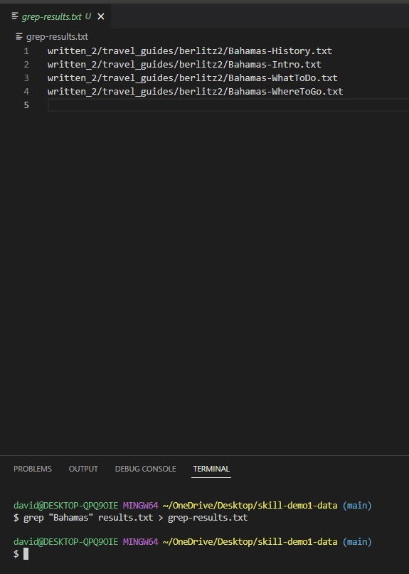
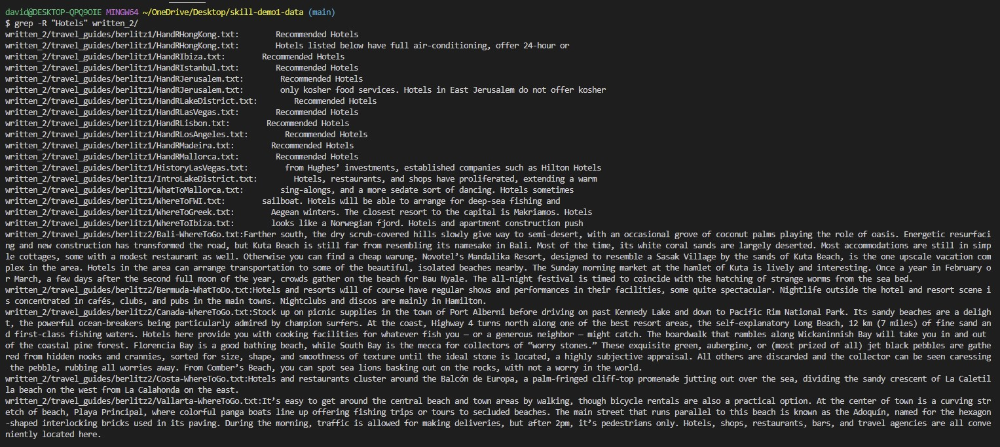
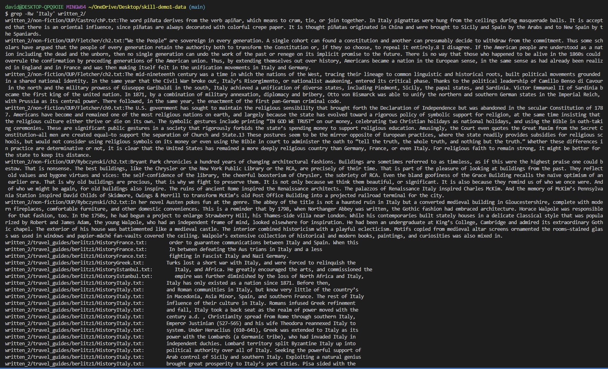

# CSE 15L Winter 2023: Lab Report 3

## grep: Git Bash Command report

### Output redirection: grep "(substring)" (old .txt file) > (new .txt file)

#### Example A

Used find to first redirect all titles of files into a single text file called "results.txt".  In Example  A, grep was used to parse through every single line in the results.txt text file to find any line with the substring "Italy."  The pictures above show the outputted results of that search being copied into a text file called "grep-results.txt", containing the titles of the 4 files in written_2/ containing the substring "Italy".

 
  
#### Example B

  
In Example B, grep was used to parse through every single line in the results.txt text file to find any line with the substring "Bahamas."  The pictures above show the outputted results of that search being copied into a text file called "grep-results.txt", containing the titles of the 4 files in written_2/ containing the substring "Bahamas".
  
 

### Recursive search: grep -R "(substring)" (directory)
  
#### Example C

  
(https://www.cyberciti.biz/faq/grep-in-bash/#:~:text=How%20do%20I%20use,display%20those%20line%20on%20screen.) The -R extension to the grep command employs a recursive search through the contents of every single file contained within the written_2/ directory.  For Example C, the very-specific substring "Bailando con el Diablo" was recursively searched for in all files in written_2/.  As seen in the terminal, the output returned the two files in written_2/ and the specific lines which the substring was contained/mentioned.

 

#### Example D

For Example D, the substring "Italy" was recursively searched for in all files in written_2/.  As seen in the terminal, the output returned a large amount of files which had lines containing the substring "Italy".  On the left side is the title of the file which contained the substring "Italy"; on the right side of the title is the specific string containing "Italy".  
  
 
  
### Simplifying the results: grep -l "(substring") (directory)
  
#### Example E

The -l extension to the grep command allows for a simplification of the results produced by any grep search.  In Example D, we used the -r extension to recursively search for every file containing at least one instance of the substring "Italy"; however, the terminal was flooded with information that is ultimately unnecessary for finding the title of the file containing an instance of a substring, as it also returned the sentence in which it first appeared.  In this Example E, the -l extension removes the clutter, only returning the title of the files which contain at least one instance of "Italy".  Here, it is much more clear how many and what files contain "Italy" in its contents.
  
 
  
#### Example F

  
The -l extension to the grep command allows for a simplification of the results produced by any grep search.  This Example F employs the same -R -l combination as Example E, just using a more specific substring to return two files containing the instance(s) of "The United States".  For smaller and more niche results like this, it might be redundant to use the -l extension for so few files.  However, it still produces the exact first instance of the substring: so it may prove to be useful in the end for certain uses.
  
 
  
### Deep recursive search: grep -Rw "(substring)" (directory)
  
#### Example G

  
(https://www.cyberciti.biz/faq/grep-in-bash/#:~:text=How%20do%20I%20use,display%20those%20line%20on%20screen.) The -Rw extension to the grep command is an even deeper recursive search for a certain substring.  Not only does it return the files which contain the lines with the searched substring, it returns every single instance of the substring throughout the entire directory.  For example, if one file has more than one instance of the substring "Italy", it will return the title of that file twice, but appended to the right will be the two separate line instances in which the substring appeared.  

 
  
#### Example H

  
Just to utilize every single grep command extension mentioned in this lab report, the -Rw extension is supported by the following extensions: -l and >.  For Example H, -l simplified the results of -Rw by only returning the titles of the files which contain the substring instance.  However, note that, for example, if a file name is returned multiple times, it is because the instance appeared in multiple, separate lines in that specific file.  The ">" extension redirected the output into a text file called "grep-results.txt", of which the contents are shown in the last screenshot.
  
  
  
